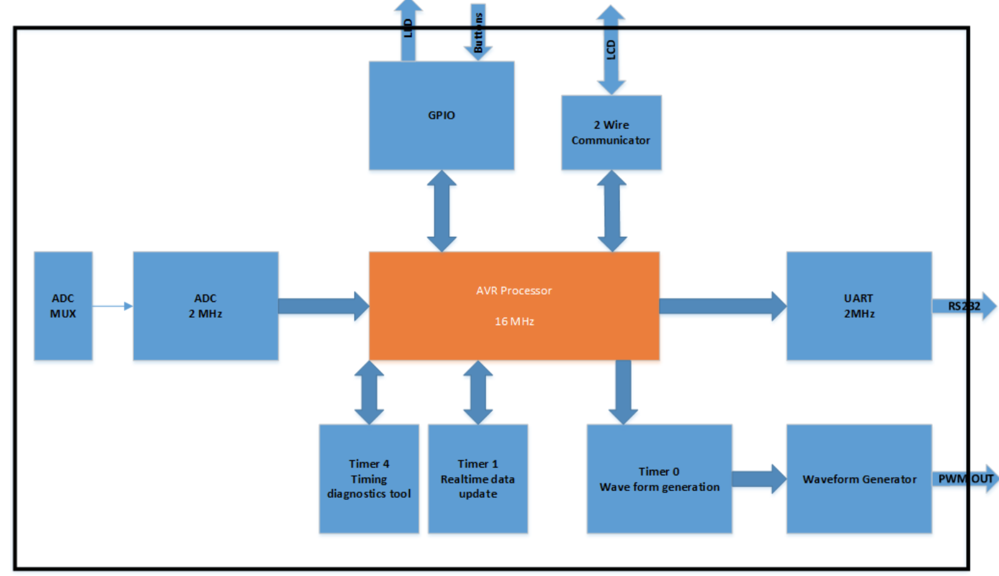
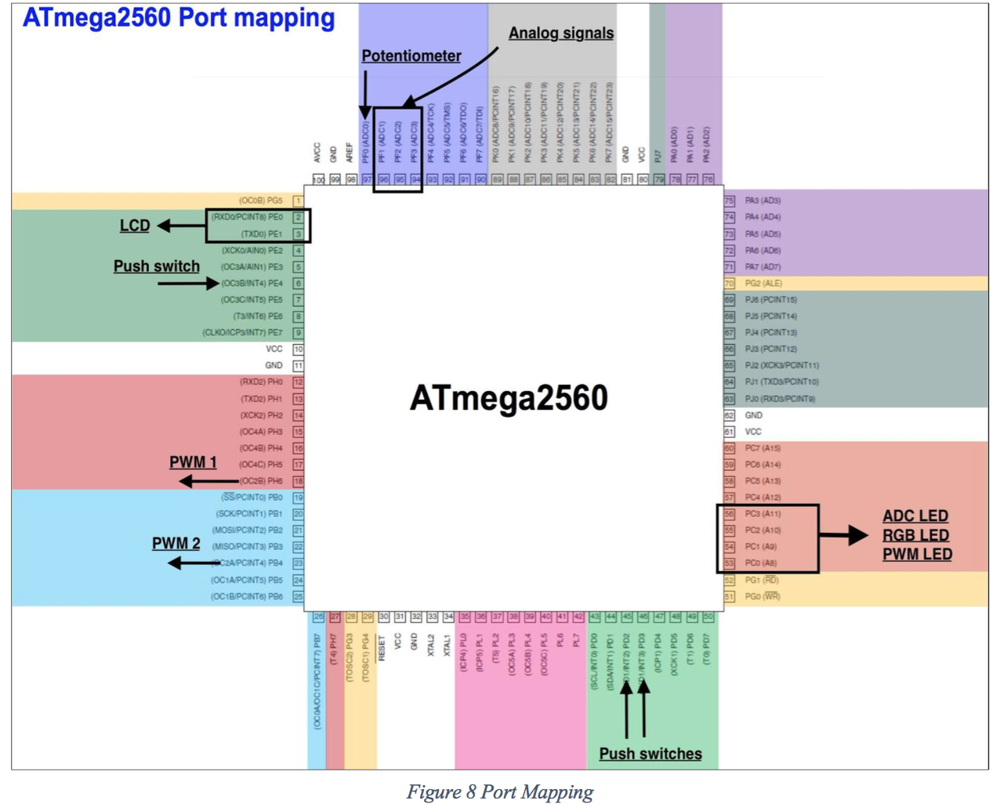
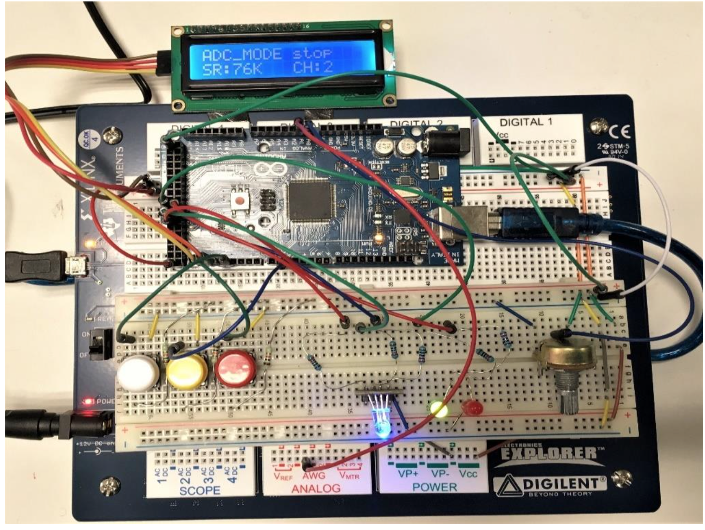
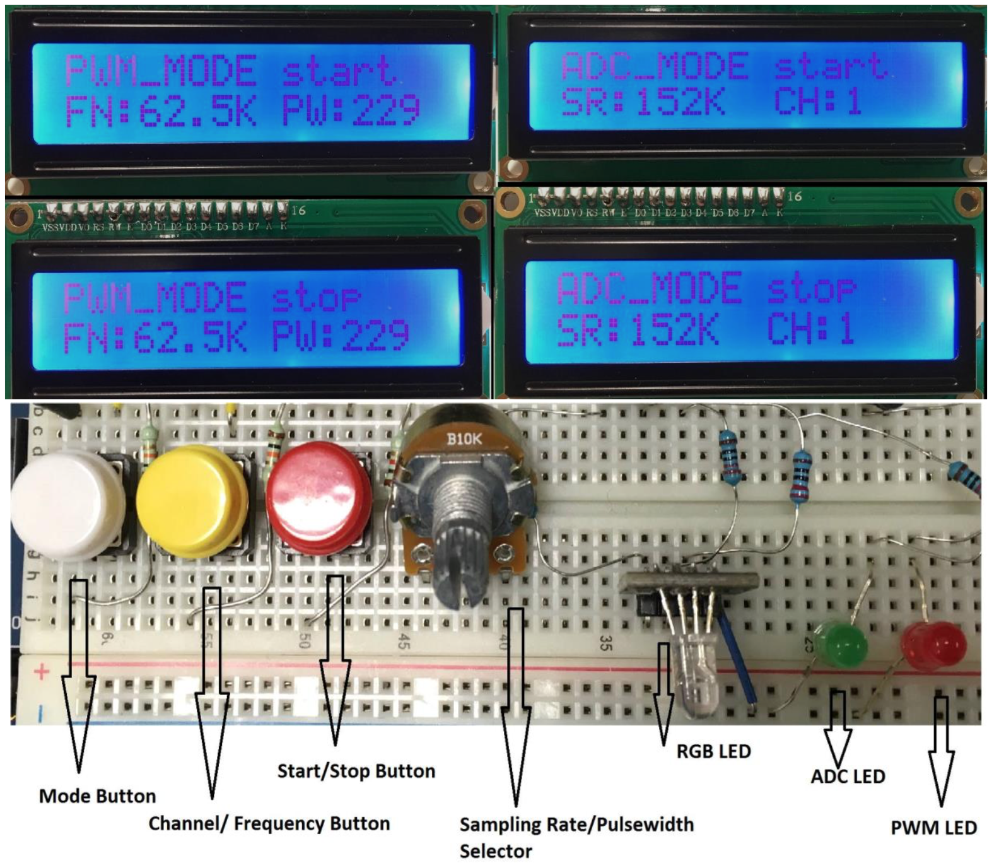
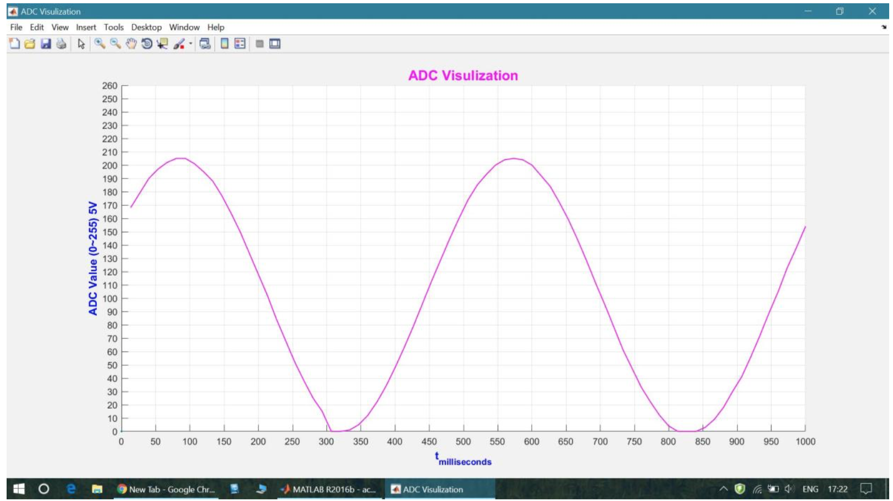

#Oscilloscope & Waveform generator
This project is a coursework of the subject - Modern Embedded Systems Programming (USN norway, lecturer Richard Anthony). Our poject is an attempt to use the cheaply available- powerful 8 BIT microcontroller ATMEGA 2560 to implement a usb Oscilloscope & Waveform generator. This microcontroller contains a 10bit Analog to Digital Convertor, 4-USART, 6 Timer/Counter, Waveform generators as well. This makes it a heavily armed device and a smart way of tackling its limits can bring a low cost solution for hobbyists problems.
###Main subject focus
* Atmel/AVR processors -ATmega2560 MCU (8-bit Processor)
* Embedded Systems Concept, Archetecture, Programming, etc.

###Programming Languages
1. AVR RISC Assembler
2. Embedded C

**IDE Atemel Studio 7**
[Download Link](http://www.atmel.com/microsite/atmel-studio/)

##Introduction 
Our projects fundamental idea is to push the limits of ADC module on the chip (ATMEGA 2560) to sample the highest possible frequency keeping the Nyquist Sampling Theorem as reference. Sampling frequency should be always greater than or equal to two times of the signal frequency.

𝒇𝒔𝒂𝒎𝒑𝒍𝒆 ≥ 𝟐𝒇𝒔𝒊𝒈𝒏𝒂𝒍

Then push this digital converted analog data through UART- (Asynchronous operation is preferred) to the PC serial port. Use a script in MATLAB to read this serial data and visualize it graphically. This compiles the idea of a signal visualizer. Use the PWM- Timer modules to generate high frequency signals with variable pulse width according to the user needs. This can serve as a signal generator. The interest is in highly calibrated time constrain signals rather than generating a random pulse. This need a careful push of these modules to reach its limits to exploits its functionality.

##User Insructions
* Select ADC Mode
	1. Power ON the module,
	2. PUSH the Mode button and select ADC Mode
	3. Then the GREEN LED will be turned ON and LCD will display ADC MODE
	4. Now push the channel select button repeatedly to select the input channel number
	5. The channel number will be displayed on the LCD and RGB LED Will light GREEN -Channel 1, Blue -Channel 2, RED -Channel 3
	6. Use the POT meter to select the sampling rate and it will be displayed on the LCD.
	7. Then push the start button to start the operation. Now the Green LED will be blinking to indicate ADC is running.
	8. During the runtime, MODE button and Channel button will be disabled.
	9. Connect UART to PC and run the MATLAB code to see the input signal.
	10. To stop operation, push the Start button again.
* Select PWM Mode
	1. PUSH the Mode button and select PWM Mode
	2. Then the RED LED will be turned ON and LCD will display PWM MODE
	3. Now push the frequency select button repeatedly to select the PWM frequency
	4. Use the POT meter to select the pulse width and it will be displayed on the LCD.
	5. Then push the start button to start the operation. Now the RED LED will be blinking
to indicate PWM is running.
	6. During the runtime, MODE button and frequency button will be disabled.
	7. To stop operation, push the Start button again.

**Block Diagram**

**Port Mapping**

**Prototype UI**

**ADC Visualiazer**

